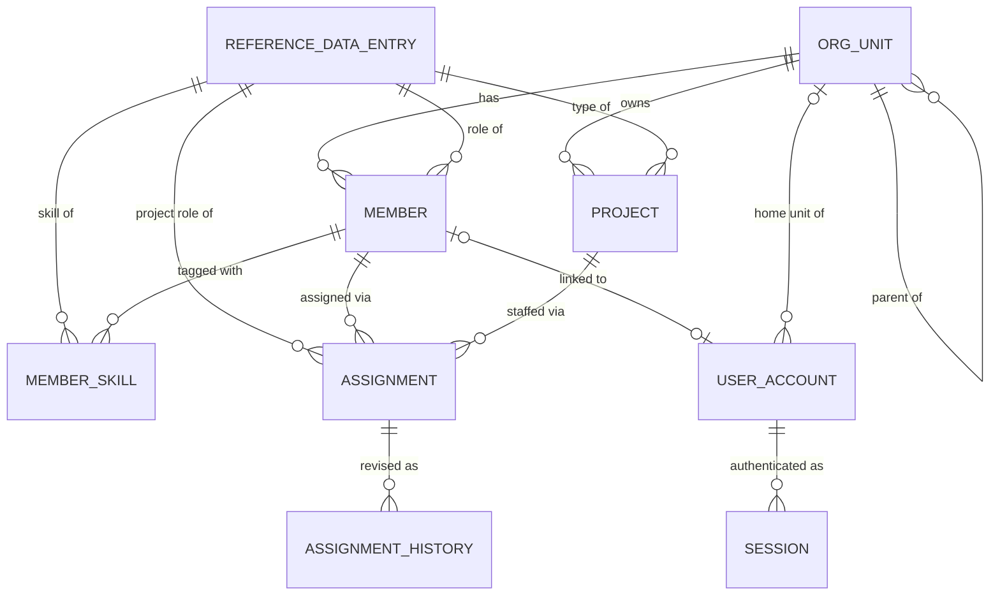

# Domain Entities — `core-domain`

**Project**: C.H.A.O.S (chaos-manager)
**Phase**: 🟢 CONSTRUCTION · **Unit**: `core-domain` · **Stage**: Functional Design
**Date**: 2026-07-25

**Technology-agnostic.** Types below are logical (`Text`, `Date`, `Decimal(4,1)`, `Boolean`, `Json`).
Concrete column types and the database product are decided at NFR Requirements (**OD-01**).

## Design Decisions Applied

| Q | Decision |
|---|---|
| 1 | **Append-only history table** for assignments (closes **OD-02**) |
| 2 | **Mutate in place + history record of previous values** — makes the model **bi-temporal** (see §9) |
| 3 | Allocation percentage: **decimal to one place, 0.1–100.0** |
| 4 | **Multiple concurrent assignments to the same project are permitted** and sum together |
| 5 | Deactivating a member or closing a project **auto-ends open assignments** |
| 11 | **Reserved schema-less `attributes` column** on Member and Project, unused in Phase 1 (discharges **FR-C-05**) |

All entity and attribute names are domain-neutral per **FR-C-01** — nothing here is specific to IT,
Engineering, Sales, or Ops.

---

## 1. `OrgUnit`

Two-level organizational structure (FR-O-01).

| Attribute | Type | Optional | Notes |
|---|---|---|---|
| `id` | Identifier | no | |
| `name` | Text(120) | no | Unique among siblings, case-insensitive |
| `parentOrgUnitId` | Identifier | **yes** | `null` = department (level 1); set = team (level 2) |
| `isActive` | Boolean | no | Default `true` |
| `createdAt` / `updatedAt` | Timestamp | no | |

**Constraints**
- A unit whose `parentOrgUnitId` is set must reference a unit whose own parent is `null` — enforces exactly two levels, no deeper nesting
- Self-reference prohibited
- Not hard-deletable while any Member, Project, or child OrgUnit references it (FR-O-04)

---

## 2. `ReferenceDataEntry`

Generic lookup for roles, skills, and project types (FR-C-02, Q8:C of Application Design).

| Attribute | Type | Optional | Notes |
|---|---|---|---|
| `id` | Identifier | no | |
| `referenceType` | Enum | no | `ROLE` · `SKILL` · `PROJECT_TYPE` |
| `name` | Text(120) | no | Unique per `referenceType`, case-insensitive |
| `isActive` | Boolean | no | Default `true`; deactivation is the retirement mechanism (FR-C-04) |
| `createdAt` / `updatedAt` | Timestamp | no | |

**Constraints**
- `(referenceType, lower(name))` unique
- Not hard-deletable while referenced; deactivate instead (FR-C-04, US-ADM-02)
- Rename propagates automatically because references are by `id`, never by name

---

## 3. `Member`

One entity for on-roll and off-roll people, distinguished by attribute (FR-M-02).

| Attribute | Type | Optional | Notes |
|---|---|---|---|
| `id` | Identifier | no | |
| `externalRef` | Text(64) | yes | **Natural key** for import duplicate detection (FR-I-04); unique when present |
| `fullName` | Text(200) | no | |
| `email` | Text(254) | no | Unique, case-insensitive |
| `orgUnitId` | Identifier | no | Exactly one (FR-O-03) |
| `employmentType` | Enum | no | `ON_ROLL` · `OFF_ROLL` |
| `roleId` | Identifier | no | → `ReferenceDataEntry` where `referenceType = ROLE` |
| `status` | Enum | no | `ACTIVE` · `INACTIVE` |
| `deactivatedOn` | Date | yes | Set when status becomes `INACTIVE`; drives the Q5:A auto-end cascade |
| `vendorName` | Text(200) | conditional | **Required when `employmentType = OFF_ROLL`** |
| `contractStartDate` | Date | conditional | Required when `OFF_ROLL` |
| `contractEndDate` | Date | conditional | Required when `OFF_ROLL` |
| `contractStatus` | Text(60) | conditional | Required when `OFF_ROLL` |
| `attributes` | Json | yes | **Reserved for Phase 2 custom fields — unused in Phase 1** (FR-C-05) |
| `createdAt` / `updatedAt` | Timestamp | no | |

**Capacity**: not stored. Every member's capacity is a fixed **100.0%** (AS-01, resolved Q10:B at User
Stories planning). The constant is expressed once, in the Allocation component, so a later phase can
promote it to an attribute without touching callers.

**Contract fields on conversion**: when an off-roll member becomes on-roll, contract fields are
**retained, not cleared** (US-MEM-02) — they are historical fact.

**Lifecycle**

```
              create
                |
                v
           +--------+   deactivate    +----------+
           | ACTIVE | --------------> | INACTIVE |
           +--------+                 +----------+
                ^                          |
                +---------- reactivate ----+

Deactivation triggers: auto-end all open assignments at deactivatedOn  [Q5:A]
Reactivation does NOT restore auto-ended assignments.
```

---

## 4. `MemberSkill`

Join entity (FR-M-05).

| Attribute | Type | Notes |
|---|---|---|
| `memberId` | Identifier | → `Member` |
| `skillId` | Identifier | → `ReferenceDataEntry` where `referenceType = SKILL` |

Composite primary key `(memberId, skillId)`. Free-text skills are rejected — a skill must exist as
reference data first (US-MEM-03).

---

## 5. `Project`

| Attribute | Type | Optional | Notes |
|---|---|---|---|
| `id` | Identifier | no | |
| `code` | Text(40) | no | **Natural key**, unique, case-insensitive |
| `name` | Text(200) | no | |
| `description` | Text | yes | |
| `owningOrgUnitId` | Identifier | no | Exactly one (FR-O-03) |
| `projectTypeId` | Identifier | no | → `ReferenceDataEntry` where `referenceType = PROJECT_TYPE` |
| `startDate` | Date | no | |
| `plannedEndDate` | Date | no | Must be ≥ `startDate` |
| `status` | Enum | no | `ACTIVE` · `CLOSED` |
| `closedOn` | Date | yes | Set when status becomes `CLOSED`; drives the Q5:A auto-end cascade |
| `attributes` | Json | yes | **Reserved for Phase 2 custom fields — unused in Phase 1** (FR-C-05) |
| `createdAt` / `updatedAt` | Timestamp | no | |

**Cross-org assignment is permitted** — a member from one org unit may be assigned to a project owned by
another (FR-O-04).

---

## 6. `Assignment`

The core of the domain. A member's time-bounded, percentage-based commitment to a project.

| Attribute | Type | Optional | Notes |
|---|---|---|---|
| `id` | Identifier | no | |
| `memberId` | Identifier | no | → `Member` |
| `projectId` | Identifier | no | → `Project` |
| `allocationPercentage` | Decimal(4,1) | no | **0.1 – 100.0**, one decimal place (Q3:C) |
| `startDate` | Date | no | Inclusive (AS-03) |
| `endDate` | Date | no | **Inclusive** (AS-03) |
| `projectRoleId` | Identifier | yes | → `ReferenceDataEntry` where `referenceType = ROLE`; optional (FR-A-10, Unit 2 story US-ASN-04) |
| `savedAsOverride` | Boolean | no | `true` when saved through an explicit over-allocation override (FR-A-06) |
| `status` | Enum | no | `ACTIVE` · `ENDED` |
| `endedEarlyOn` | Date | yes | Set when ended before its original `endDate` |
| `createdAt` / `updatedAt` | Timestamp | no | |
| `createdByUserId` / `updatedByUserId` | Identifier | no | Actor attribution — needed for the history table |

### Decimal arithmetic rule

`allocationPercentage` is **fixed-point, never floating-point**. It is stored and computed as an
**integer number of tenths** internally (`50.0% → 500`), converted for display only. Summation of
percentages is therefore exact. A float representation is **order-dependent**:
`33.3 + 33.3 + 33.4 === 100` but `33.4 + 33.3 + 33.3 === 99.99999999999999`, so a comparison against the
threshold would depend on row order. Over-allocation detection compares against exactly `1000` tenths.

### Multiple assignments to one project

Permitted per **Q4:B**. A member may hold several concurrent assignments to the same project, and their
percentages sum like any others.

**Consequence to design for**: the project staffing view (US-PRJ-04) may show the same member on several
rows for one project. `frontend-components.md` specifies that such rows are grouped under the member with
a subtotal, so the view does not read as duplicate data.

### `ENDED` versus expired

`status = ENDED` means *administratively terminated* (ended early, or auto-ended by the Q5:A cascade). An
assignment whose `endDate` has simply passed remains `ACTIVE` — it is historically valid and still
contributes to as-of-date queries for dates inside its range. **Status is not a proxy for currency**;
currency is always derived from dates.

---

## 7. `AssignmentHistory`

Append-only. **Never updated, never deleted.** Closes **OD-02** via Q1:B, and is what makes Q2:C's
mutate-in-place safe.

| Attribute | Type | Optional | Notes |
|---|---|---|---|
| `id` | Identifier | no | |
| `assignmentId` | Identifier | no | → `Assignment` |
| `revisionNumber` | Integer | no | 1, 2, 3… per assignment |
| `operation` | Enum | no | `CREATE` · `UPDATE` · `END_EARLY` · `AUTO_END` |
| `recordedAt` | Timestamp | no | **Transaction time** — when the change was made |
| `supersededAt` | Timestamp | yes | `recordedAt` of the next revision; `null` on the current revision |
| `actorUserId` | Identifier | no | Who made the change |
| `allocationPercentage` | Decimal(4,1) | no | Value **after** this change |
| `startDate` | Date | no | Value after this change |
| `endDate` | Date | no | Value after this change |
| `projectRoleId` | Identifier | yes | Value after this change |
| `savedAsOverride` | Boolean | no | Value after this change |
| `status` | Enum | no | Value after this change |

**Snapshot, not delta.** Each row is the complete state of the assignment *after* the change. Storing
snapshots rather than diffs means reconstructing state at any past instant is a single indexed lookup
rather than a replay, which matters because reconstruction feeds a user-facing query (US-ASN-07).

**Invariant**: the current `Assignment` row must always equal the revision whose `supersededAt` is `null`.
This is a checkable consistency property and `business-rules.md` states it as one.

---

## 8. `UserAccount`

| Attribute | Type | Optional | Notes |
|---|---|---|---|
| `id` | Identifier | no | |
| `username` | Text(120) | no | Unique, case-insensitive |
| `passwordHash` | Text | no | **Argon2id**, salt embedded in the encoded hash (Q10:A) |
| `passwordAlgorithm` | Text(40) | no | Records the algorithm and parameters used, so hashes can be upgraded later without guessing |
| `role` | Enum | no | `ADMIN` · `RESOURCE_MANAGER` · `TEAM_LEAD` · `TEAM_MEMBER` · `EXECUTIVE` |
| `homeOrgUnitId` | Identifier | yes | Scope anchor for `TEAM_LEAD`; `null` for org-wide roles |
| `linkedMemberId` | Identifier | yes | **Unique when present** — at most one account per member (FR-AU-05) |
| `isActive` | Boolean | no | Inactive accounts cannot sign in (US-ACC-01) |
| `createdAt` / `updatedAt` | Timestamp | no | |

**No plaintext password field exists anywhere in the model** (FR-AU-02, US-ENB-02). A plaintext password
appears only as a transient function parameter and is never logged, returned, or persisted.

**Not every member has an account.** `linkedMemberId` is optional in both directions — members are
trackable without a login, and accounts can exist without a member record (US-ACC-04).

---

## 9. `Session`

Server-side session records per **Q8:A**.

| Attribute | Type | Optional | Notes |
|---|---|---|---|
| `id` | Identifier | no | Internal row identifier |
| `tokenHash` | Text | no | **Hash of the opaque session token**, not the token itself — a leaked session table cannot be replayed |
| `userAccountId` | Identifier | no | → `UserAccount` |
| `createdAt` | Timestamp | no | |
| `lastSeenAt` | Timestamp | no | Updated on activity; drives the sliding window |
| `expiresAt` | Timestamp | no | `lastSeenAt + 30 minutes` (Q9:B) |
| `terminatedAt` | Timestamp | yes | Set on explicit sign-out |

**Expiry policy** (Q9:B): sliding inactivity window, **30 minutes**, configurable. A session is valid iff
`terminatedAt is null AND now < expiresAt`.

**Note on the choice**: 30 minutes is tighter than a business-hours internal tool strictly needs and will
mean re-authenticating after a long meeting. It is what you selected, and it is trivially adjustable —
the window is configuration, not code.

---

## 10. Bi-Temporality — the consequence of Q1:B + Q2:C

Choosing an append-only history table *and* mutate-in-place gives the model **two independent time axes**.
This is more capability than the date-ranged-rows-only option, and it needs stating plainly because
US-ASN-07's acceptance criteria actually span both.

| Axis | Question it answers | Where it lives |
|---|---|---|
| **Valid time** | *Which assignments were in effect on 15 March?* | `Assignment.startDate` … `endDate` |
| **Transaction time** | *What did that assignment look like as the records stood on 15 March?* | `AssignmentHistory.recordedAt` … `supersededAt` |

**Why this matters concretely.** Suppose an assignment ran 1 Jan – 30 Jun at 50%, and on 1 May a manager
edited it to 80%. Under mutate-in-place, the `Assignment` row now says 80% for the whole range.

- A **valid-time-only** query for March reads the current row and reports **80%** — factually wrong about March.
- A **bi-temporal** query for March reconstructs from `AssignmentHistory` the revision current as of the March date and reports **50%** — correct.

US-ASN-07's third criterion ("it appears as it stood on that date") requires the second behaviour.
Therefore:

> **Design rule**: as-of-date historical queries (US-ASN-07) resolve against `AssignmentHistory`, **not**
> against the current `Assignment` rows. Only present-and-future queries (US-VIS-01, US-VIS-02) read
> current rows. `business-logic-model.md` §5 specifies both paths.

Had Q2 been answered A or D, this reconstruction would have been impossible and US-ASN-07 would have
needed narrowing. Q1:B + Q2:C buys correctness at the cost of one extra write per change and one extra
query path.

---

## 11. Entity Relationship Diagram



### Text Alternative

```
ORG_UNIT
  +-- parent of --> ORG_UNIT            (self, exactly 2 levels)
  +-- has -------> MEMBER               (1 : many, mandatory)
  +-- owns ------> PROJECT              (1 : many, mandatory)
  +-- home unit of -> USER_ACCOUNT      (0..1 : many)

REFERENCE_DATA_ENTRY  (ROLE | SKILL | PROJECT_TYPE)
  +-- role of ---------> MEMBER
  +-- type of ---------> PROJECT
  +-- skill of --------> MEMBER_SKILL
  +-- project role of -> ASSIGNMENT     (optional)

MEMBER
  +-- tagged with --> MEMBER_SKILL      (many : many via join)
  +-- assigned via -> ASSIGNMENT        (1 : many)
  +-- linked to ----> USER_ACCOUNT      (0..1 : 0..1, unique both ways)

PROJECT
  +-- staffed via --> ASSIGNMENT        (1 : many; MULTIPLE concurrent per member allowed, Q4:B)

ASSIGNMENT
  +-- revised as ---> ASSIGNMENT_HISTORY  (1 : many, append-only, snapshot per revision)

USER_ACCOUNT
  +-- authenticated as -> SESSION       (1 : many)
```

---

## 12. Indexing Intent

Logical, not physical — the concrete plan lands at NFR Requirements once **OD-01** is settled. Listed
because these are the accesses the allocation algorithm depends on (**R2-1**).

| Access pattern | Driving story | Index intent |
|---|---|---|
| Assignments overlapping a date range for a set of members | US-VIS-01, US-VIS-02, US-ASN-05 | `(memberId, startDate, endDate)` — the single most important index in the system |
| Assignments for a project | US-PRJ-04 | `(projectId, startDate, endDate)` |
| Current revision per assignment | consistency invariant | `(assignmentId, supersededAt)` |
| Revision current at a past instant | US-ASN-07 | `(assignmentId, recordedAt, supersededAt)` |
| Member search and filter | US-MEM-04, US-VIS-03 | `(orgUnitId, status)`, `(roleId)`, plus `MemberSkill(skillId, memberId)` |
| Session validation on every request | all | `(tokenHash)` unique |
| Natural-key duplicate detection on import | US-IMP-04 (Unit 2) | `Member(externalRef)` unique, `Member(email)` unique, `Project(code)` unique |
| Contracts expiring soon | US-MEM-06 (Unit 2) | `(employmentType, contractEndDate)` |
