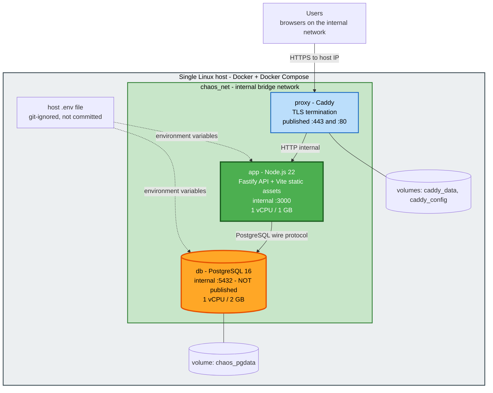

# Deployment Architecture — `core-domain`

**Project**: C.H.A.O.S (chaos-manager)
**Phase**: 🟢 CONSTRUCTION · **Unit**: `core-domain` (1 of 2) · **Stage**: Infrastructure Design
**Date**: 2026-07-25

## 1. Topology



### Text Alternative

```
Users (browsers, internal network)
   |
   |  HTTPS to host IP  (ports 443, and 80 redirecting to 443)
   v
[ Single Linux host: Docker + Docker Compose ]
   |
   +-- proxy container (Caddy)
   |      TLS termination, HTTP-to-HTTPS redirect
   |      published: 443, 80
   |      volumes: caddy_data, caddy_config
   |      |
   |      |  HTTP over internal bridge network "chaos_net"
   |      v
   +-- app container (Node.js 22)
   |      Fastify API + Vite-built static assets
   |      internal port 3000 - NOT published to host
   |      1 vCPU / 1 GB, non-root, restart unless-stopped
   |      runs migrations at startup before accepting traffic
   |      |
   |      |  PostgreSQL wire protocol, internal only
   |      v
   +-- db container (PostgreSQL 16)
          internal port 5432 - NOT published to host
          1 vCPU / 2 GB, restart unless-stopped
          volume: chaos_pgdata -> /var/lib/postgresql/data

   host .env file (git-ignored) supplies environment variables to app and db

Only ports 80 and 443 are reachable from outside the host.
One Node application process. Three containers total.
```

---

## 2. Compose Services

| Service | Image | Published | Depends on | Restart |
|---|---|---|---|---|
| `proxy` | `caddy:2-alpine` | `443`, `80` | `app` | `unless-stopped` |
| `app` | built from `./` | none | `db` (healthy) | `unless-stopped` |
| `db` | `postgres:16-alpine` | none | — | `unless-stopped` |

**Volumes**: `chaos_pgdata`, `caddy_data`, `caddy_config`
**Network**: `chaos_net` (bridge)

### Startup order

```
1. db starts
2. db healthcheck (pg_isready) passes
3. app starts  -- Compose waits for db to be healthy
4. app runs pending migrations                    <-- before listening
5. app runs first-run bootstrap if needed          <-- see section 4
6. app begins listening on :3000
7. proxy starts and begins accepting traffic on :443
```

**Migrations run inside the `app` container at startup, before it listens** (step 4). Rationale: it
guarantees the schema matches the code that is about to serve traffic, and it needs no separate migration
step in the deployment procedure — which matters because there is no CI to run one (NFR-Q-01).

**Consequence, stated rather than hidden**: a failing migration means the app does not start. That is the
correct behaviour — serving traffic against a half-migrated schema would be worse — but it does mean a bad
migration takes the service down rather than degrading it. The rollback procedure in §5 covers this.

---

## 3. Build Procedure

Built on the host from source (Q3:A) — no registry, no CI.

```
# On the deployment host
git clone <repo> /opt/chaos-manager
cd /opt/chaos-manager
cp .env.example .env          # then edit: set secrets
docker compose build
docker compose up -d
docker compose logs -f app    # confirm migrations applied and the app is listening
```

**Multi-stage build** (`Dockerfile` at the repository root):

```
Stage 1  frontend-build   node:22-alpine
         npm ci in frontend/, vite build  ->  frontend/dist

Stage 2  backend-build    node:22-alpine
         npm ci in backend/, tsc          ->  backend/dist

Stage 3  runtime          node:22-alpine
         npm ci --omit=dev in backend/
         COPY backend/dist, backend/migrations
         COPY frontend/dist (served as static assets by Fastify)
         USER node
         CMD node dist/server.js
```

TypeScript, Vite, and all dev dependencies stay out of the runtime image.

---

## 4. First-Run Setup

Sequenced deliberately — reference data must exist before members and projects can be created, because
`roleId`, `projectTypeId`, and `orgUnitId` are all required and must reference existing records
(BR-M-01, BR-M-04, BR-P-01).

| Step | Action | Why |
|---|---|---|
| 1 | Migrations create the schema | Nothing exists before this |
| 2 | Seed **minimal reference data** — one department org unit, and a small starter set of roles, skills, and project types | Without at least one org unit and one role, **no member can be created at all**, so the system would be unusable on first start |
| 3 | Create the **initial admin account** from `INITIAL_ADMIN_USERNAME` and `INITIAL_ADMIN_PASSWORD`, password hashed with Argon2id | Someone has to be able to sign in |
| 4 | Log a clear instruction to change the admin password and remove `INITIAL_ADMIN_PASSWORD` from `.env` | The bootstrap secret should not persist |

**Seeded reference data is starter data, not fixed data.** Every seeded row is an ordinary
`ReferenceDataEntry` an Admin can rename or deactivate (BR-C-02, BR-C-05). Seeding does not compromise
FR-C-01 domain neutrality or FR-C-06 team-type agnosticism — the seed set uses generic values, and a Sales
or Ops team replaces them through the admin screens with no code change.

**Idempotent**: steps 2–4 run only when the relevant tables are empty. Restarting a configured system
seeds nothing and creates no second admin.

---

## 5. Upgrade and Rollback

### Upgrade

```
cd /opt/chaos-manager
docker compose exec db pg_dump -U "$POSTGRES_USER" "$POSTGRES_DB" > /opt/chaos-backups/pre-upgrade-$(date +%F).sql
git pull
docker compose build
docker compose up -d
docker compose logs -f app     # confirm migrations applied
```

**Take the backup before the upgrade, every time.** It is the only rollback path for a schema change.

### Rollback

| Failure | Recovery |
|---|---|
| App fails to start; **migrations did not run** | `git checkout <previous-tag>`, rebuild, `up -d`. No data implication. |
| App fails to start; **migrations partially applied** | Restore the pre-upgrade dump (§6), then check out the previous version and rebuild. **This is why the pre-upgrade backup is mandatory.** |
| App runs but a defect is found | Check out the previous version and rebuild. Safe **only if no migration ran**; otherwise restore the dump first. |
| Database container will not start | Inspect logs; the volume is intact unless explicitly removed. `docker compose down` does **not** delete named volumes — `down -v` does. |

> **⚠️ `docker compose down -v` destroys the database volume.** The deployment guide must state this
> prominently. Migrations are forward-only (U1-NFR-M-08), so there is no `migrate down` path — restore from
> a dump instead.

---

## 6. Backup (Q6:A)

Documented command and suggested schedule. No tooling built, no automation added to the stack.

### Backup

```
docker compose exec -T db pg_dump -U "$POSTGRES_USER" -Fc "$POSTGRES_DB" \
  > /opt/chaos-backups/chaos-$(date +%F-%H%M).dump
```

### Suggested cron (host crontab) — daily at 02:00, 14-day retention

```
0 2 * * * cd /opt/chaos-manager && docker compose exec -T db pg_dump -U chaos -Fc chaos > /opt/chaos-backups/chaos-$(date +\%F).dump 2>>/var/log/chaos-backup.log
30 2 * * * find /opt/chaos-backups -name 'chaos-*.dump' -mtime +14 -delete
```

### Restore

```
docker compose stop app
docker compose exec -T db pg_restore -U "$POSTGRES_USER" -d "$POSTGRES_DB" --clean --if-exists \
  < /opt/chaos-backups/chaos-YYYY-MM-DD.dump
docker compose start app
```

**Position stated honestly**: NFR-Q-03 defers backup as a project requirement, and Q6:A does not change
that — nothing here is built, scheduled, or monitored by the application. What it provides is a *tested
procedure* so that a volume loss is recoverable rather than terminal. **Whether the cron entry is actually
installed, and whether anyone verifies a restore works, is an operations decision outside this project.**
An unverified backup is not a backup.

---

## 7. Operational Runbook

| Task | Command |
|---|---|
| Start | `docker compose up -d` |
| Stop (preserves data) | `docker compose down` |
| Stop and **destroy data** | `docker compose down -v` — ⚠️ deletes the volume |
| Logs, live | `docker compose logs -f app` |
| Logs, recent errors | `docker compose logs --since 1h app \| grep -i error` |
| Health | `curl -k https://<host-ip>/health` |
| Database shell | `docker compose exec db psql -U "$POSTGRES_USER" "$POSTGRES_DB"` |
| Restart the app only | `docker compose restart app` |
| Disk usage | `docker system df` and `du -sh /opt/chaos-backups` |
| Rebuild after code change | `docker compose build app && docker compose up -d app` |

---

## 8. Local Development

Q1:A specified one environment, with developers running the same stack locally. Two supported modes:

| Mode | How | Use |
|---|---|---|
| **Full stack in Compose** | `docker compose up -d` | Verifying the deployment path; closest to production |
| **Hot-reload development** | `docker compose up -d db` for PostgreSQL only, then `npm run dev` in `backend/` (tsx watch) and `frontend/` (Vite dev server proxying `/api` to `localhost:3000`) | Day-to-day work — the practical mode |

Development uses the **same PostgreSQL version and the same migrations** as production. Nothing about the
schema differs between the two, which is what makes a single-environment deployment safe.

---

## 9. Validation

| Check | Result |
|---|---|
| Startup order guarantees schema before traffic | **Pass** — migrations run before listening |
| Restart loses no committed data | **Pass** — named volume; sessions in the database |
| Only 80 and 443 reachable from outside the host | **Pass** — `app` and `db` ports unpublished |
| Secrets never committed | **Pass** — host `.env`, `.env.example` holds no real values |
| First run produces a usable system | **Pass** — seeded reference data and an admin account, sequenced so member creation is possible |
| Rollback path exists for every failure mode | **Pass** — §5, contingent on the pre-upgrade backup |
| Backup and restore documented and runnable | **Pass** — §6, with the honest caveat that installing and verifying it is an operations decision |
| Single Node application process | **Pass** |
