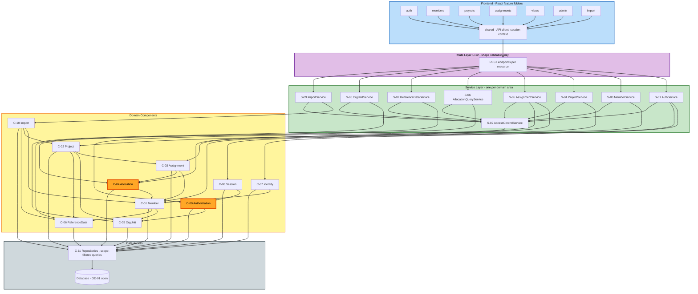

# Component Dependencies — C.H.A.O.S

**Project**: chaos-manager
**Stage**: INCEPTION → Application Design
**Diagram format**: Mermaid with mandatory text alternative (Q10:A, per `common/content-validation.md`)

---

## 1. Dependency Matrix

Rows depend on columns. `●` = direct dependency.

| Depends on → | C-01 Member | C-02 Project | C-03 Assign | C-04 Alloc | C-05 OrgUnit | C-06 RefData | C-07 Identity | C-08 Session | C-09 Authz | C-10 Import | C-11 Repos |
|---|---|---|---|---|---|---|---|---|---|---|---|
| **C-01 Member** | — | | | | ● | ● | | | | | ● |
| **C-02 Project** | | — | ● | | ● | ● | | | | | ● |
| **C-03 Assignment** | ● | ● | — | ● | | ● | | | | | ● |
| **C-04 Allocation** | ● | | ● | — | | | | | | | ● |
| **C-05 OrgUnit** | | | | | — | | | | | | ● |
| **C-06 ReferenceData** | | | | | | — | | | | | ● |
| **C-07 Identity** | ● | | | | | | — | | | | ● |
| **C-08 Session** | | | | | | | ● | — | ● | | ● |
| **C-09 Authorization** | | | | | ● | | | | — | | ● |
| **C-10 Import** | ● | ● | | | ● | ● | | | | — | ● |
| **C-11 Repositories** | | | | | | | | | | | — |

### Acyclicity

**No circular dependencies exist.** Two near-cycles were deliberately broken:

1. **C-02 Project → C-03 Assignment** (project staffing needs assignments) with no reverse dependency, even though C-03 validates that a project is open. C-03 obtains project state through the repository layer, not by calling C-02. Verified one-directional.
2. **C-03 Assignment ↔ C-04 Allocation** would be a cycle if C-04 called C-03 for data. It does not: **C-04 reads assignment data through C-11 repositories**, and C-03 calls C-04 only for the over-allocation check. The arrow C-04 → C-03 in the matrix denotes a data-shape dependency on the `Assignment` type, not a runtime call.

**Dependency depth**: 4 levels — Route (C-12) → Services (S-01…S-09) → Domain (C-01…C-10) → Repositories (C-11).

---

## 2. Component Dependency Diagram



**Highlighted in orange**: C-04 Allocation (all capacity arithmetic) and C-09 Authorization (all access
decisions) — the two components every other part of the system leans on.

### Text Alternative

```
Layer 1: FRONTEND (React, feature folders)
  auth, members, projects, assignments, views, admin, import
    all depend on --> shared (API client, session context)
    shared depends on --> Route Layer

Layer 2: ROUTE LAYER (C-12)
  REST endpoints per resource. Shape validation only, no business rules.
    depends on --> Service Layer (exactly one service per handler)

Layer 3: SERVICE LAYER
  S-01 AuthService ................ --> C-07 Identity, C-08 Session
  S-02 AccessControlService ....... --> C-09 Authorization, C-05 OrgUnit
  S-03 MemberService .............. --> C-01 Member
  S-04 ProjectService ............. --> C-02 Project
  S-05 AssignmentService .......... --> C-03 Assignment, C-04 Allocation
  S-06 AllocationQueryService ..... --> C-04 Allocation
  S-07 ReferenceDataService ....... --> C-06 ReferenceData
  S-08 OrgUnitService ............. --> C-05 OrgUnit
  S-09 ImportService .............. --> C-10 Import
  ALL services also depend on ..... --> S-02 AccessControlService

Layer 4: DOMAIN COMPONENTS
  C-01 Member ........ --> C-05, C-06
  C-02 Project ....... --> C-03, C-05, C-06
  C-03 Assignment .... --> C-01, C-04, C-06
  C-04 Allocation .... --> C-01  (assignment data read via repositories)
  C-05 OrgUnit ....... --> (none)
  C-06 ReferenceData . --> (none)
  C-07 Identity ...... --> C-01
  C-08 Session ....... --> C-07, C-09
  C-09 Authorization . --> C-05
  C-10 Import ........ --> C-01, C-02, C-05, C-06

Layer 5: DATA ACCESS
  C-11 Repositories (scope-filtered queries) --> Database (OD-01 open)
  All domain components depend on C-11.

No circular dependencies. Dependency depth: 4 levels.
```

---

## 3. Communication Patterns

| Pattern | Where used | Notes |
|---|---|---|
| **Synchronous in-process calls** | Everywhere | Single deployable (layered monolith, Q1:A). No message bus, no queues, no inter-service network calls in Phase 1. |
| **Scope filter threading** | Every service → component → repository call | `ScopeFilter` is passed down and applied **inside** the query, never as a post-fetch trim. This is the mechanism behind FR-R-08 and US-ENB-01. |
| **Request/response over REST** | Frontend → Route layer | JSON over HTTP, endpoints per resource (Q6:A). |
| **Two-step confirmation** | Assignment create/update with over-allocation | First call returns findings with `assignment: null`; client re-submits with the override flag (US-ASN-05). Also used for project close with open assignments (US-PRJ-02) and reference-data deletion with references (US-ADM-02). |
| **Transactional batch** | Import execution | Valid rows commit together; failed and conflicting rows excluded without aborting (US-IMP-03). |
| **Pure computation** | C-04 Allocation | Takes assignment data and criteria, returns computed results. Holds no state, performs no writes — which is what makes it verifiable in isolation, and matters given no automated test suite in Phase 1 (NFR-Q-01). |

---

## 4. Data Flow — Three Critical Paths

### 4.1 Create an assignment with over-allocation detection

The most involved path in the application (US-ASN-01, US-ASN-05, US-ASN-06).

```
[F-04 assignments UI]
   POST /api/assignments  { memberId, projectId, allocationPercentage, period }
        |
        v
[C-12 Route]  validate shape only; resolve session
        |
        v
[S-05 AssignmentService]
   1. S-02 AccessControlService --> C-09  assertCanWrite(ASSIGNMENT, target org units)
   2. C-01 Member       --> confirm member ACTIVE
   3. C-02 Project      --> confirm project OPEN  (via repository read)
   4. C-03 Assignment   --> date-range conflict checks
                            end<start | contract window | member active period
   5. C-04 Allocation   --> detectOverAllocation(memberId, candidate)
                            reads overlapping assignments via C-11
                            segments the range at every change point
                            returns findings per over-allocated SUB-PERIOD
        |
        +-- findings empty ------------------> 7. persist via C-03
        |
        +-- findings present, override=false -> return findings, assignment=null
        |                                       PERSIST NOTHING
        |
        +-- findings present, override=true --> 6. persist via C-03
                                                   marked savedAsOverride=true
        |
        v
[C-11 Repositories]  insert within transaction spanning steps 5-7
        |
        v
[Response]  { assignment, overAllocation[], savedAsOverride, conflicts[] }
        |
        v
[F-04]  no findings  -> success
        findings     -> warning dialog naming member, sub-period, resulting total
                        user confirms -> re-submit with overrideOverAllocation=true
                        user cancels  -> nothing was persisted
```

**Concurrency note**: steps 5 to 7 must be transactionally atomic, or a concurrent assignment could be
written between the check and the save, producing an unflagged over-allocation. Isolation level and
locking strategy are a **Functional Design** obligation.

### 4.2 Availability search over a future period

The path that delivers the Phase 1 success criterion (US-VIS-02, US-VIS-03).

```
[F-05 views UI]
   GET /api/allocations/availability?start&end&skillIds&orgUnitIds&roleIds&employmentType
        |
        v
[C-12 Route]  parse and validate dates and filters; resolve session
        |
        v
[S-06 AllocationQueryService]
   1. S-02 --> C-09  resolve AccessScope, derive ScopeFilter
   2. C-01 Member    --> candidate member set matching filters, within scope
   3. C-04 Allocation --> availability(query, scopeFilter)
                          a. C-11 fetch assignments overlapping range for candidates
                          b. segment range at every assignment start/end boundary
                          c. per segment: total = sum(percentages)
                                          available = 100 - total
                          d. classify: available | fully allocated | OVER-ALLOCATED
   4. order results so highest available capacity surfaces first
   5. paginate
        |
        v
[Response]  Page<AvailabilityResult> with per-segment availability
        |
        v
[F-05]  availability table; over-allocated members flagged distinctly
        from merely unavailable; empty result shown explicitly
```

**Performance note**: this is the query that must satisfy **NFR-S-03** (sub-3-second) and the
under-a-minute success criterion. At the design target of 200 members and 50 projects the data volume is
small, but the segmentation in step 3b is the part that scales with assignment count. Query and
computation strategy is an **R2 folded-in obligation** for Functional Design.

### 4.3 CSV import with row-level error reporting

```
[F-07 import UI]
   POST /api/import/members   (multipart file upload)
        |
        v
[C-12 Route]  validate upload present and content type
        |
        v
[S-09 ImportService]
   1. S-02 --> C-09  assertCanWrite(IMPORT)   -- Admin only
   2. C-10 parse    --> rows[] + unrecognisedColumns[]
   3. C-10 validate --> per row, independently:
        - required fields present
        - off-roll rows carry contract fields; end date after start date
        - C-06 validateIds  --> role and skill values matched, unmatched REPORTED
        - C-05             --> org unit matched
        - natural key vs existing records      -> RowConflict EXISTING_RECORD
        - natural key vs other rows in file    -> RowConflict DUPLICATE_WITHIN_FILE
        collects ALL reasons per failed row, not just the first
   4. C-10 execute  --> C-01 create members for VALID rows only
        |
        v
[C-11 Repositories]  valid rows commit in one transaction;
                     failed and conflicting rows excluded WITHOUT aborting
        |
        v
[Response]  ImportReport { createdCount, failedRows[{row, reasons[]}], conflictRows[] }
        |
        v
[F-07]  created count + downloadable per-row error and conflict report;
        re-uploading corrected rows does not duplicate successful ones
```

---

## 5. Unit Seam — Component to Unit Assignment

Per **CQ1:A**, the seam is **Core Domain / Supporting Platform**, and both units are full-stack so the
Slice 1 vertical thread survives intact (DA-01, DA-02).

### Unit 1 — Core Domain

**Backend**: C-01 Member · C-02 Project · C-03 Assignment · C-04 Allocation · C-05 OrgUnit ·
C-06 ReferenceData · C-07 Identity (local authentication only) · C-08 Session · C-11 Repositories ·
C-12 Route layer (Unit 1 endpoints)
**Services**: S-01 AuthService · S-03 MemberService · S-04 ProjectService · S-05 AssignmentService ·
S-06 AllocationQueryService · S-07 ReferenceDataService · S-08 OrgUnitService
**Frontend**: F-01 auth · F-02 members · F-03 projects · F-04 assignments · F-05 views · F-08 shared
**Contains all of Slice 1**: US-ACC-01, US-ENB-02, US-MEM-01, US-PRJ-01, US-ASN-01, US-VIS-01 ✅

### Unit 2 — Supporting Platform

**Backend**: C-09 Authorization (full RBAC and org-scope enforcement) · C-10 Import ·
C-11 extensions · C-12 Route layer (Unit 2 endpoints)
**Services**: S-02 AccessControlService (full implementation) · S-09 ImportService
**Frontend**: F-06 admin · F-07 import
**Also carries**: US-ENB-03 and US-ENB-04 completion, plus the Should-priority refinements
(US-MEM-06, US-ASN-04, US-VIS-05, US-VIS-06, US-VIS-07, US-ACC-04, US-IMP-05)

### Cross-Seam Dependencies

Two dependencies cross from Unit 1 into Unit 2. Both are handled by interface-first construction, and
both are stated here so they are not discovered during Code Generation.

| # | Dependency | Handling |
|---|---|---|
| **X-1** | Every Unit 1 service depends on **S-02 AccessControlService** and **C-09 Authorization**, which live in Unit 2 | Unit 1 implements `IAuthorizationComponent` as a **minimal permissive stand-in**: it resolves the session's role and returns a scope filter, but does not yet enforce org-unit restriction. Unit 2 replaces the implementation behind the unchanged interface. **Consequence**: until Unit 2 completes, org-scope restrictions are not enforced — the same gap already documented as Wave 5 in `stories.md` §9.3. If Unit 1 is exposed to real users before Unit 2 lands, a Team Lead will see data beyond their org unit. |
| **X-2** | **C-10 Import** (Unit 2) depends on C-01, C-02, C-05, C-06 (Unit 1) | One-directional and forward only — Unit 2 depends on completed Unit 1 components, never the reverse. Requires no stand-in and matches the build order in `stories.md` §9.3, where import is Wave 8. |

**Seam quality**: Unit 1 has no *runtime* dependency on Unit 2 beyond the X-1 interface, and Unit 2
depends only on finished Unit 1 work. The seam is therefore clean in one direction and interface-mediated
in the other — which is what makes a 2-unit split viable and keeps the R1 constraint satisfied without
needing a third unit.
