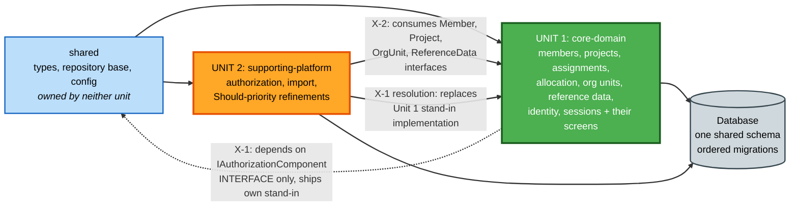

# Unit Dependencies — C.H.A.O.S

**Project**: chaos-manager
**Stage**: INCEPTION → Units Generation (Part 2: Generation)
**Date**: 2026-07-25

## 1. Unit Dependency Matrix

Rows depend on columns.

| Depends on → | `core-domain` | `supporting-platform` | `shared` |
|---|---|---|---|
| **`core-domain`** | — | **Interface only** (X-1) | ● |
| **`supporting-platform`** | ● (X-2) | — | ● |
| **`shared`** | | | — |

**No circular dependencies.** The apparent two-way relationship between the units is not a cycle:

- `supporting-platform` → `core-domain` is a **real runtime dependency** on completed code (X-2)
- `core-domain` → `supporting-platform` is an **interface dependency only** (X-1). Unit 1 depends on the `IAuthorizationComponent` *interface*, not on Unit 2's implementation of it. Unit 1 ships its own stand-in implementation, so it compiles, runs, and is demonstrable with no Unit 2 code present.

The interface itself lives in `backend/src/shared/types/`, which belongs to neither unit (Q8:A). That
placement is what breaks the cycle: both units depend on `shared`, and `shared` depends on nothing.

---

## 2. Dependency Diagram



### Text Alternative

```
shared  (types, repository base, config - owned by neither unit, depends on nothing)
   |
   +--> UNIT 1: core-domain
   |       members, projects, assignments, allocation, org units,
   |       reference data, identity, sessions, and their screens
   |       - depends on shared
   |       - depends on IAuthorizationComponent INTERFACE (in shared), not on Unit 2
   |       - ships its own permissive stand-in implementation  [X-1]
   |       - writes to the shared database schema
   |
   +--> UNIT 2: supporting-platform
           authorization, import, Should-priority refinements
           - depends on shared
           - depends on completed Unit 1 interfaces:              [X-2]
             IMemberComponent, IProjectComponent,
             IOrgUnitComponent, IReferenceDataComponent
           - REPLACES Unit 1's authorization stand-in             [X-1 resolution]
           - writes to the shared database schema

Build order: shared -> core-domain -> supporting-platform  (sequential, Q5:A)
No circular dependencies. The interface lives in shared, which breaks the apparent cycle.
```

---

## 3. Cross-Unit Dependencies in Detail

### X-1 — Unit 1 depends on Authorization, which Unit 2 owns

| Attribute | Detail |
|---|---|
| **Direction** | `core-domain` → `IAuthorizationComponent` interface (in `shared`) |
| **Nature** | Interface dependency. Every one of Unit 1's seven services calls `AccessControlService`, which calls `IAuthorizationComponent`. |
| **Resolution** | Q6:A — Unit 1 ships a **permissive stand-in** at `backend/src/core-domain/authorization-standin/`. It resolves the session's role from `VerifiedIdentity` and returns a `ScopeFilter` of `{ orgUnitIds: 'ALL', restrictToMemberId: null }`. Role is known; org-unit restriction is not applied. |
| **Replacement** | Unit 2 implements the real `C-09 AuthorizationComponent` at `backend/src/supporting-platform/authorization/` and the stand-in directory is **deleted**. No Unit 1 caller changes, because the interface is unchanged. |
| **Blocks Unit 1?** | **No.** Unit 1 compiles, runs, and is fully demonstrable without any Unit 2 code. |

#### Consequence — stated plainly

**While Unit 1 is the only completed unit, org-scope visibility is not enforced.** Every signed-in user
sees all members, all projects, and all allocations regardless of role. A Team Lead sees other
departments; a Team Member sees other people's assignments. Role is resolved, so write permissions can
still differ, but *read* scoping is absent.

#### Condition under which this is acceptable

This is acceptable **only because Q7:A confirms a single-track build with no external pilot users during
Unit 1**. The permissive stand-in was chosen on that basis.

> **⚠️ Revisit trigger**: if the delivery model changes so that anyone outside the project team uses the
> application before `supporting-platform` completes, the X-1 decision must be revisited — switch to the
> restrictive stand-in (plan Q6:B) or pull C-09 Authorization forward into Unit 1 (plan Q1:B/Q6:C).
> This is the single highest-consequence assumption in the decomposition.

This also aligns with the pre-existing Wave 5 note in `stories.md` §9.3, which flagged the same gap from
the story-sequencing angle.

### X-2 — Unit 2 depends on completed Unit 1 components

| Attribute | Detail |
|---|---|
| **Direction** | `supporting-platform` → `core-domain` |
| **Nature** | Runtime dependency on completed code. C-10 Import creates members and projects through `IMemberComponent` and `IProjectComponent`, and validates against `IOrgUnitComponent` and `IReferenceDataComponent`. C-09 Authorization resolves scope through `IOrgUnitComponent`. |
| **Resolution** | None needed — forward-only. The sequential build order (Q5:A) guarantees Unit 1 is complete before Unit 2 begins. |
| **Blocks Unit 2?** | **Yes, correctly.** Unit 2 cannot start before Unit 1 completes. This matches Wave 8 in `stories.md` §9.3, where import lands last because it depends on every entity and validation rule being settled. |

### X-3 — Both units share one database schema

| Attribute | Detail |
|---|---|
| **Direction** | Both units → `backend/migrations/` |
| **Nature** | Unit 2's import writes Unit 1's entities, so per-unit schemas would be a fiction. |
| **Resolution** | Q8:A — **one shared schema with ordered migration files**. Unit 1 creates the core tables; Unit 2 adds only `RolePermission` and any indexes its scope-filtered queries require. |
| **Risk** | Unit 2 may discover it needs an index or column that Unit 1's Functional Design did not anticipate. Additive migrations handle this; the schema is not frozen at Unit 1 completion. |

---

## 4. Build Sequence

Sequential per Q5:A. The AI-DLC Construction per-unit loop runs twice.

| Order | Unit | Construction stages | Gates |
|---|---|---|---|
| 0 | `shared` | Built as part of Unit 1's Code Generation, not as a separate unit | — |
| 1 | **`core-domain`** | Functional Design → NFR Requirements → Infrastructure Design → Code Generation | 4 approval gates |
| 2 | **`supporting-platform`** | Functional Design → NFR Requirements → Infrastructure Design → Code Generation | 4 approval gates |
| 3 | *(both)* | Build and Test | 1 approval gate |

**Total: 9 stage executions.** NFR Design is skipped per R2, with its six obligations folded into each
unit's Functional Design.

### Wave order versus unit order

`stories.md` §9.3 defines a 9-wave build sequence that **interleaves the units** — RBAC at Wave 5 sits
between core-domain waves. The unit sequence cannot honour that literally, because the AI-DLC per-unit
loop completes each unit before the next begins. Per Q5:A, **wave order applies within a unit, not across
units**:

| Waves | Unit | Note |
|---|---|---|
| 1, 2, 3, 4, 6 | `core-domain` | Slice 1, reference data and org units, remaining Members/Projects, allocation and over-allocation, availability search |
| 5, 7, 8, 9 | `supporting-platform` | RBAC (was Wave 5, now runs after all of Unit 1), historical/analytical views, import, remaining enablers and refinements |

**The material effect**: Wave 5's RBAC work moves later than the story sequence intended. That is exactly
the X-1 consequence described above, arriving here by a second route — which is why it is worth stating
twice rather than once.

### Within-unit ordering for `core-domain`

1. `shared` foundations — types, repository base, configuration
2. Slice 1 thread: US-ACC-01, US-ENB-02, US-MEM-01, US-PRJ-01, US-ASN-01, US-VIS-01
3. Reference data and org units: US-ADM-03, US-ADM-01, US-ADM-02
4. Remaining Members and Projects, including validation stories
5. Multi-project allocation then over-allocation: US-ASN-02 before US-ASN-05
6. Availability search: US-VIS-02, US-VIS-03
7. Remaining Unit 1 stories

**Hard ordering constraint**: US-ASN-02 (allocation summation across overlapping ranges) must precede
US-ASN-05 (over-allocation detection), because detection consumes summation. Similarly every validation
story follows its happy-path counterpart.

### Within-unit ordering for `supporting-platform`

1. C-09 Authorization and S-02 full implementation: US-ACC-05, US-ENB-01 — then **delete the stand-in**
2. Should-priority extensions to Unit 1 screens: US-MEM-06, US-ASN-04, US-VIS-05, US-VIS-06, US-VIS-07, US-ACC-04
3. Import: US-IMP-05 template first, then US-IMP-01, US-IMP-02, then US-IMP-03, US-IMP-04

**Hard ordering constraint**: authorization comes first in Unit 2, because it closes the X-1 visibility
gap at the earliest possible moment within the sequential plan.

---

## 5. Interface Contracts Between Units

| Interface | Defined in | Unit 1 role | Unit 2 role |
|---|---|---|---|
| `IAuthorizationComponent` | `shared/types` | Consumer + **stand-in provider** | **Real provider** — replaces stand-in |
| `IMemberComponent` | `shared/types` | Provider | Consumer (import) |
| `IProjectComponent` | `shared/types` | Provider | Consumer (import) |
| `IOrgUnitComponent` | `shared/types` | Provider | Consumer (import, authorization) |
| `IReferenceDataComponent` | `shared/types` | Provider | Consumer (import) |
| `ScopeFilter`, `AccessScope` | `shared/types` | Consumer | Producer |

**Contract stability requirement**: `IAuthorizationComponent` must be defined completely in Unit 1 even
though only a stand-in implements it. If Unit 2 needs to widen the interface, every Unit 1 call site
changes — which is precisely the rework the stand-in pattern exists to avoid. Getting this interface right
is a **Unit 1 Functional Design obligation**, and it is R2 folded-in obligation 4 arriving early.

---

## 6. Risk Notes

| Risk | Unit | Mitigation |
|---|---|---|
| Allocation arithmetic is the highest-risk code and has no automated test suite (NFR-Q-01) | 1 | Isolated in C-04 as pure computation; US-ASN-02 built before US-ASN-05 so summation is verified before detection depends on it; Given/When/Then criteria serve as manual acceptance checks |
| X-1 visibility gap during Unit 1 | 1 | Accepted on the basis of Q7:A; revisit trigger documented above; Unit 2 addresses authorization first |
| `IAuthorizationComponent` interface designed against a stand-in may prove insufficient | 1→2 | Interface completeness is an explicit Unit 1 Functional Design obligation |
| Unit 2 discovers schema needs Unit 1 did not anticipate | 2 | Additive ordered migrations; schema not frozen at Unit 1 completion |
| Unit 2 is not independently demonstrable, so progress is harder to show | 2 | Demonstrated by behavior change in Unit 1 screens rather than by new screens; stated explicitly rather than discovered |
