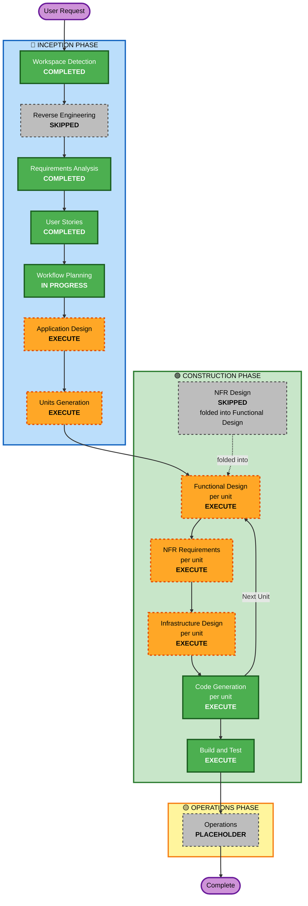

# Execution Plan — C.H.A.O.S

**Project**: chaos-manager
**Stage**: INCEPTION → Workflow Planning
**Date**: 2026-07-25
**Project Type**: Greenfield
**Status**: APPROVED 2026-07-25T10:15:00Z with two user-directed revisions (see Revision Log)

## Revision Log

| # | Date | Change | Source |
|---|---|---|---|
| R1 | 2026-07-25 | **Units Generation constrained to fewer units** — target 2, hard cap 3 (was "approximately 3 to 5") | User direction at Workflow Planning approval |
| R2 | 2026-07-25 | **NFR Design changed from EXECUTE to SKIP** — its content folded into Functional Design | User direction at Workflow Planning approval |

## Context Loaded

- `aidlc-docs/inception/requirements/requirements.md` (approved) — 59 functional requirements, 7 NFR groups, 4 open decisions (OD-04 since closed)
- `aidlc-docs/inception/requirements/requirement-verification-questions.md` + `requirements-clarification-questions.md` (answered)
- `aidlc-docs/inception/user-stories/stories.md` (approved) — 43 stories, 35 Must / 8 Should, Slice 1 identified, 9-wave sequence
- `aidlc-docs/inception/user-stories/personas.md` (approved) — 3 full personas + 2 thin variants
- Reverse engineering artifacts: **none** — greenfield project

---

## 1. Detailed Analysis Summary

### 1.1 Transformation Scope

**Not applicable** — greenfield project. No existing components, no deployment model migration, no
cross-package impact, no component relationship graph.

### 1.2 Change Impact Assessment

| Impact area | Assessment |
|---|---|
| **User-facing changes** | **Yes** — the entire deliverable is a new user interface. Five roles, seven feature areas, 38 persona-facing stories. Replaces an established spreadsheet workflow, so adoption risk is real and sits in UX rather than in code. |
| **Structural changes** | **Yes** — the whole architecture is new: React SPA, Node.js/TypeScript API, relational data store, containerized for on-premises deployment. No existing structure constrains it. |
| **Data model changes** | **Yes, and this is the crux.** A new model of members, projects, and temporally-bounded percentage assignments. The additive-over-overlapping-date-ranges allocation rule (FR-A-03) is the single most consequential modelling decision in the project — every view, warning, and report derives from it. |
| **API changes** | **Yes** — a new API surface. NFR-IN-03 and US-ENB-04 require the boundary to be client-agnostic so a later mobile app and future integrations can consume it. |
| **NFR impact** | **Yes, but modest.** Small scale (200 members, 50 projects), business-hours availability, sub-3-second page loads, on-premises Docker. No HA, no monitoring stack, no encryption-at-rest, no CI required in Phase 1. All three AI-DLC extensions disabled. |

### 1.3 Application Layer Impact

- **Code**: entire application — React frontend, Node.js/TypeScript API, data access layer, database schema and migrations
- **Dependencies**: all new — Node runtime, API framework, ORM or query builder, React and its build tooling, password-hashing library, CSV/Excel parsing library
- **Configuration**: environment-based configuration for database connection, session settings, and the configurable contract-expiry window (US-MEM-06)
- **Testing**: unit tests produced by the Build and Test stage. Note NFR-Q-01 defers a formal test suite and CI, so the 43 stories' Given/When/Then criteria serve as manual acceptance checks

### 1.4 Infrastructure Layer Impact

- **Deployment model**: on-premises containers via Docker; Kubernetes optional (NFR-T-01)
- **Networking**: single-host or simple internal deployment; no load balancer, no multi-region, no service mesh
- **Storage**: persistent volume for the database
- **Scaling**: none required — low-tens concurrent users (NFR-S-02)

### 1.5 Operations Layer Impact

Minimal by explicit decision. Monitoring, structured logging, alerting, backup/restore, and CI/CD are
all deferred per Q17:A and CQ6:A. The Operations phase remains a placeholder.

### 1.6 Risk Assessment

- **Risk Level**: **Medium**
- **Rollback Complexity**: **Easy** — greenfield with no production system to break and no data to migrate (Q22:B)
- **Testing Complexity**: **Moderate** — the allocation logic has genuine combinatorial surface (overlapping ranges, partial-period over-allocation, as-of-date queries), and NFR-Q-01's deferral of automated testing means that surface is checked manually

**Why Medium and not Low**, given greenfield and easy rollback — four specific concerns:

1. **Temporal allocation logic is the hard part and it is load-bearing.** Overlapping date ranges, partial-period over-allocation detection (US-ASN-05), and as-of-date historical queries (US-ASN-07) are where correctness bugs will hide. Every view depends on getting the summation right.
2. **No automated test suite (NFR-Q-01) against that logic.** The riskiest code in the system has the least mechanical verification. This is the largest single risk in the plan.
3. **RBAC lands in Wave 5**, after the core domain. If Phase 1 reaches real users before then, org-scope restrictions are not enforced (stories.md §9.3).
4. **Adoption risk exceeds technical risk.** Success is defined behaviorally — a manager answering "who is available next month?" in under a minute. A correct implementation that is slower than the spreadsheet still fails that bar.

**Mitigations already in the plan**: the Slice 1 vertical thread proves the stack end-to-end before
breadth is added; the 9-wave sequence builds allocation summation (US-ASN-02) before over-allocation
detection depends on it; Functional Design will resolve OD-02 before code is generated.

---

## 2. Workflow Visualization

### Mermaid Diagram



### Text Alternative

```
Phase 1: INCEPTION
- Stage 1: Workspace Detection ................ COMPLETED
- Stage 2: Reverse Engineering ................ SKIPPED (greenfield)
- Stage 3: Requirements Analysis .............. COMPLETED
- Stage 4: User Stories ....................... COMPLETED
- Stage 5: Workflow Planning .................. IN PROGRESS
- Stage 6: Application Design ................. EXECUTE
- Stage 7: Units Generation ................... EXECUTE

Phase 2: CONSTRUCTION  (stages 8, 9, 11, 12 repeat once per unit of work)
- Stage 8:  Functional Design ................. EXECUTE (per unit)
- Stage 9:  NFR Requirements .................. EXECUTE (per unit)
- Stage 10: NFR Design ........................ SKIPPED (folded into Functional Design)
- Stage 11: Infrastructure Design ............. EXECUTE (per unit)
- Stage 12: Code Generation ................... EXECUTE (per unit)
- Stage 13: Build and Test .................... EXECUTE (once, after all units)

Phase 3: OPERATIONS
- Stage 14: Operations ........................ PLACEHOLDER
```

---

## 3. Phases to Execute

### 🔵 INCEPTION PHASE

- [x] Workspace Detection — **COMPLETED**
- [x] Reverse Engineering — **SKIPPED**
  - **Rationale**: Greenfield project. No source files, no build files, no application structure. Nothing exists to reverse-engineer.
- [x] Requirements Analysis — **COMPLETED** (approved 2026-07-25T09:20:00Z)
- [x] User Stories — **COMPLETED** (approved 2026-07-25T10:00:00Z)
- [x] Workflow Planning — **IN PROGRESS**
- [ ] Application Design — **EXECUTE**
  - **Rationale**: Every execution criterion is met. This is a greenfield system where all components are new; component responsibilities, the service layer, and inter-component dependencies have no existing structure to inherit. Skipping it would push architecture decisions into Code Generation, where they get made implicitly and inconsistently. It also resolves the interface between allocation computation and the views that consume it — the highest-value design decision in the project.
- [ ] Units Generation — **EXECUTE** *(revised R1)*
  - **Rationale**: Four criteria met — new data models, a new API surface, non-trivial business logic in allocation, and 43 stories that need grouping into buildable increments. The Construction phase runs its per-unit loop over whatever units this stage produces, so skipping it would force all 43 stories through a single undifferentiated Code Generation pass.
  - **Revision R1 constraint**: **target 2 units, hard cap 3.** Units will be drawn along the coarsest defensible seam rather than along the seven feature areas. The most likely split is (a) a core unit carrying the domain — members, projects, assignments, allocation computation, views — and (b) a supporting unit carrying access control, authentication, reference-data administration, and import. If Units Generation cannot produce a coherent 2-unit split, it will produce 3 and state why. It will not produce more than 3 without returning to you first.

### 🟢 CONSTRUCTION PHASE

- [ ] Functional Design — **EXECUTE** (per unit) — *scope expanded by R2, see NFR Design below*
  - **Rationale**: New data models and genuinely complex business logic. The temporal allocation rules — summation across overlapping date ranges, partial-period over-allocation detection, as-of-date historical reconstruction — need designing before they are coded, not during. This stage also closes open decision **OD-02** (whether allocation history is date-ranged rows alone or rows plus a history table) and carries forward **FR-C-05**, the Phase 2 custom-fields extension point that has no user story.
- [ ] NFR Requirements — **EXECUTE** (per unit)
  - **Rationale**: Two open decisions remain that only this stage can close: **OD-01** (database technology) and **OD-03** (Node.js API framework and React tooling). The backend and frontend languages are fixed by Q16:D, but the stack is not fully determined. Performance targets exist (NFR-S-03, sub-3-second page loads) and need to be attached to concrete technology choices. Expect **minimal-to-standard depth** — the NFR surface is deliberately small.
- [ ] NFR Design — **SKIPPED** *(revised R2)*
  - **Rationale**: Skipped at user direction, with its content **folded into Functional Design** rather than dropped. With HA, monitoring, encryption-at-rest, and CI all deferred by Q17:A, the NFR pattern surface was too thin to justify a separate stage and approval gate.
  - **Folded-in obligations — Functional Design must now also cover**:
    - Data access strategy and the boundary between allocation computation and persistence
    - Session handling design
    - The replaceable authentication boundary required by **US-ENB-03**
    - Server-side authorization enforcement points required by **US-ENB-01** and **FR-R-08**
    - The client-agnostic API boundary required by **US-ENB-04** and **NFR-IN-03**
    - Performance approach for allocation and availability queries against **NFR-S-03** (sub-3-second)
  - **Note**: These are not dropped requirements. If Functional Design does not visibly address all six, the fold has failed and NFR Design should be reinstated.
- [ ] Infrastructure Design — **EXECUTE** (per unit)
  - **Rationale**: On-premises containerized deployment (NFR-T-01) needs specification — container topology, database persistence, configuration and secret injection, and how the application is started and stopped on your own servers. Without this stage, the generated code arrives with no defined way to run it. Expect **minimal depth**: a single-host Docker composition, not a cloud architecture.
- [ ] Code Generation — **EXECUTE** (ALWAYS, per unit)
  - **Rationale**: Mandatory. Runs in two parts per unit — a planning part producing an explicit, checkbox-tracked generation plan for your approval, then the generation part. Application code lands at the workspace root, never in `aidlc-docs/`.
- [ ] Build and Test — **EXECUTE** (ALWAYS, once after all units)
  - **Rationale**: Mandatory. Produces build instructions, unit test instructions, and integration test instructions across units. Given NFR-Q-01's deferral of a formal test suite and CI, this stage's output is the primary verification asset for Phase 1 — which raises its importance rather than lowering it.

### 🟡 OPERATIONS PHASE

- [ ] Operations — **PLACEHOLDER**
  - **Rationale**: Not implemented in AI-DLC. Deployment, monitoring, incident response, and production readiness are future expansion. Consistent with Q17:A deferring monitoring, backup, and HA out of Phase 1.

---

## 4. Stage Summary

| Decision | Count | Stages |
|---|---|---|
| **Completed** | 4 | Workspace Detection, Requirements Analysis, User Stories, Workflow Planning |
| **Skipped** | 2 | Reverse Engineering, NFR Design *(R2 — folded into Functional Design)* |
| **To execute** | 7 | Application Design, Units Generation, Functional Design, NFR Requirements, Infrastructure Design, Code Generation, Build and Test |
| **Placeholder** | 1 | Operations |

Four of the seven remaining stages run **once per unit**: Functional Design, NFR Requirements,
Infrastructure Design, and Code Generation. With Units Generation constrained to 2 units (R1), the
per-unit loop runs twice.

---

## 5. Package Change Sequence

**Not applicable** — greenfield project with no existing packages. The equivalent artifact is the
9-wave story build sequence in `stories.md` §9.3, which the units produced by Units Generation are
expected to respect.

---

## 6. Estimated Timeline

Expressed in AI-DLC stage executions rather than calendar time, because elapsed duration depends
almost entirely on your review and approval cadence at each gate, not on generation time.

| Segment | Stage executions | Notes |
|---|---|---|
| Remaining Inception | 2 | Application Design, Units Generation — each with one approval gate |
| Construction, per unit | 4 | Functional Design, NFR Requirements, Infrastructure Design, Code Generation — each with one approval gate |
| Construction, once | 1 | Build and Test |
| **Total at 2 units** | **≈ 11** | 2 + (4 × 2) + 1 |
| **Total at 3 units** | **≈ 15** | 2 + (4 × 3) + 1 |

**Revised down from ≈23** by the two user-directed changes: R1 (fewer units) and R2 (NFR Design folded
into Functional Design). Both revisions reduce ceremony, not scope — every functional requirement and
every story remains in Phase 1, and the six NFR Design obligations are carried explicitly into
Functional Design.

---

## 7. Success Criteria

### Primary Goal

A manager can answer **"who is available next month?"** in under a minute (Q21:B), using a system that
replaces the current allocation spreadsheet.

### Key Deliverables

1. Running web application — React frontend, Node.js/TypeScript API, relational database, containerized for on-premises deployment
2. Slice 1 demonstrable end-to-end: sign in → create member → create project → assign with percentage and date range → view resulting allocation
3. All 35 Must-priority stories implemented
4. Over-allocation detection with visible, overridable warnings
5. Current-state allocation view and forward-looking availability view with skill, role, org-unit, and employment-type filters
6. CSV/Excel import for members and projects with row-level error and duplicate-conflict reporting
7. Five RBAC roles with server-side org-scope enforcement
8. Admin-managed reference data proving team-type agnosticism without a code change
9. Build and test instructions

### Quality Gates

| Gate | Criterion |
|---|---|
| Every approval gate | Stage artifacts reviewed and explicitly approved before the next stage begins |
| Requirement coverage | All 49 Must-priority functional requirements traceable to implemented stories |
| Slice 1 | Independently demonstrable before breadth work begins (DA-01) |
| Allocation correctness | Summation across overlapping date ranges, partial-period over-allocation, and as-of-date queries verified against the Given/When/Then criteria in `stories.md` |
| Access control | Org-scope enforcement verified server-side, not only in the UI (US-ENB-01) |
| Credential handling | No plaintext or reversibly-encrypted password anywhere in the data store (US-ENB-02) |
| Domain neutrality | No IT/Engineering-specific vocabulary in any entity name, field name, or UI label (FR-C-01, US-ADM-01) |
| Open decisions | OD-01, OD-02, OD-03 closed before or during the stage they are assigned to |

### Explicitly Not Gated

Per Q17:A, CQ6:A, and NFR-Q-01: no test coverage threshold, no CI pipeline gate, no security
extension gate, no availability or performance SLA, and no formal accessibility conformance. These are
deliberate Phase 1 exclusions, not oversights.
